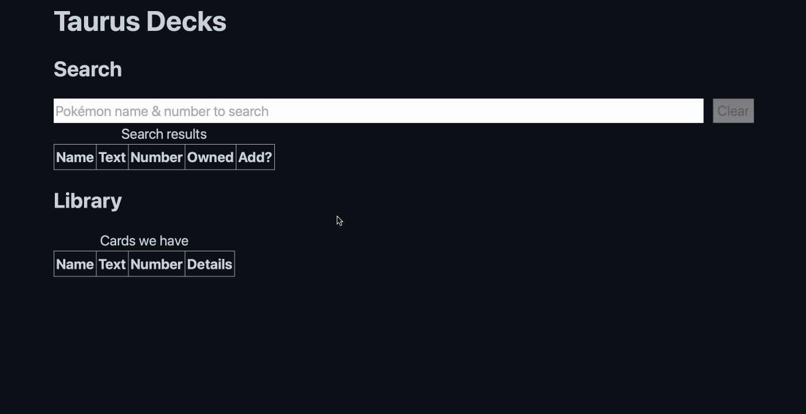

# TaurusDecks

A simple app for the kids to organize their Pokémon cards into locations. They can search for a card with its number and the Pokémon's name, and specify its location (e.g., which deck, which binder, which box), finish, condition, and any notes, and add it to a database.

## Tech

This is an Astro app built with Preact. Astro also hosts the Express.js webserver that stores the data in SQLite. We use the fantastic [Pokemon TCG Data](https://github.com/PokemonTCG/pokemon-tcg-data/) directory.

## Notes

For each card:

- card identifier
- number we own
- their locations
- notes?
- finishes

Finish has a few different types:

- normal
- holographic
- reverse-holographic
